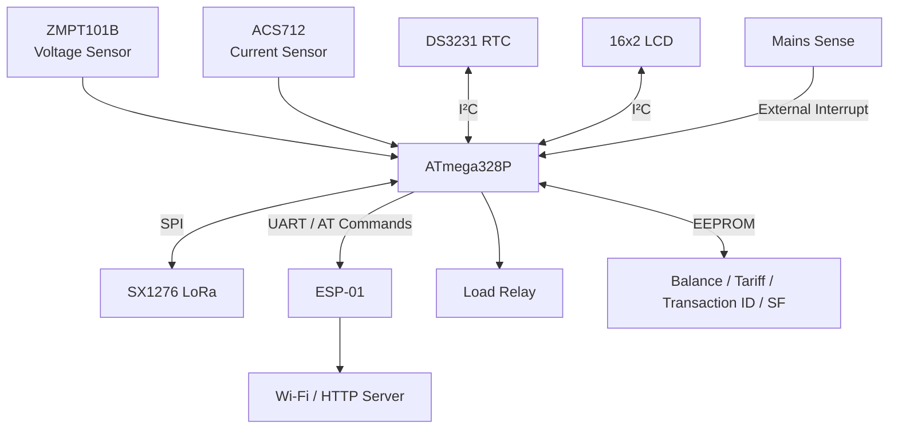

# Wireless Prepaid Energy Meter

Embedded firmware for a **prepaid smart energy meter** built around the **ATmega328P**, with local energy measurement, prepaid balance deduction, interrupt-driven power-failure handling, LoRa telemetry, Wi-Fi fallback, EEPROM persistence, and a custom lightweight DS3231 RTC driver.

The project focuses on firmware architecture and reliability rather than simply interfacing sensors. It uses **interrupt-driven event handling**, **cooperative scheduling**, **non-blocking state machines**, **direct I²C register access**, watchdog supervision, CRC-protected persistent state, and communication fallback mechanisms suitable for resource-constrained embedded systems.

---

## Firmware Highlights

### Interrupt-Driven Power-Failure Handling

Mains failure is detected using an external hardware interrupt instead of continuously polling the power-sense input.

The ISR is intentionally kept minimal:

1. Latch the power-failure event.
2. Immediately disconnect the load.
3. Set a flag for deferred processing.
4. Return from the ISR.

Operations such as EEPROM writes, LCD control, and LoRa transmission are performed later in the normal program context.

This follows an important embedded-firmware principle:

> **Do the minimum possible work inside an ISR and defer expensive operations to the main execution context.**

The resulting dying-gasp sequence is:

```text
Mains Failure
     │
     ▼
External Interrupt
     │
     ├── Open load relay immediately
     ├── Latch outage
     └── Set deferred-processing flag
                │
                ▼
           Main loop
                │
                ├── Verify outage
                ├── Disable LCD backlight
                ├── Save meter state to EEPROM
                ├── Transmit final LoRa status
                └── Wait for mains restoration
```

EEPROM is deliberately written **before** the final LoRa transmission so that the financial state has the highest chance of surviving loss of power.

---

## Cooperative Scheduling

The firmware avoids using blocking `delay()` calls during normal operation.

Instead, multiple firmware tasks are cooperatively scheduled using `millis()` timestamps.

Typical scheduled operations include:

| Task | Interval |
|---|---:|
| Energy measurement and billing | 3 s |
| LCD update | 3 s |
| LoRa telemetry | 15 s |
| EEPROM checkpoint | Rate/delta limited |
| RTC refresh | Alongside measurement cycle |

Conceptually:

```cpp
if (now - lastPower >= POWER_INTERVAL_MS) {
    processPower();
}

if (now - lastDisplay >= LCD_INTERVAL_MS) {
    lcd_update();
}

if (now - lastTelemetry >= TELEMETRY_INTERVAL_MS) {
    sendTelemetry();
}
```

This allows communication, measurement, display handling, watchdog servicing, and power-failure processing to coexist without an RTOS.

The LCD notification system also uses a timed overlay state instead of blocking the processor for several seconds.

---

## Custom DS3231 RTC Driver

One of the firmware design goals was to avoid depending on a full RTC library for a relatively small requirement.

Instead of using **RTClib**, the project contains a lightweight DS3231 driver implemented directly over the Arduino `Wire` I²C interface.

### Implemented RTC functionality

- Direct DS3231 register access
- BCD-to-decimal conversion
- Decimal-to-BCD conversion
- 12-hour and 24-hour time decoding
- Date and time readout
- Date and time configuration
- I²C communication failure detection
- DS3231 Oscillator Stop Flag detection
- Oscillator Stop Flag clearing after clock configuration

The driver reads the RTC registers directly:

```text
ATmega328P
    │
    │ I²C
    ▼
DS3231
0x68
    │
    ├── Seconds
    ├── Minutes
    ├── Hours
    ├── Date
    ├── Month
    ├── Year
    └── Status / OSF
```

Using the DS3231 **Oscillator Stop Flag (OSF)** allows the firmware to distinguish between:

- RTC unavailable
- RTC available but time not initialized
- RTC operating normally

This is more reliable than assuming the clock is invalid based only on the returned year.

Removing RTClib also reduces program-memory usage on the flash-constrained ATmega328P.

---

## System Architecture



---

## Hardware

The meter firmware is designed around an **Arduino Uno/Nano or equivalent ATmega328P platform**.

### Main components

| Component | Purpose |
|---|---|
| ATmega328P | Main MCU |
| ZMPT101B | AC voltage sensing |
| ACS712 | AC current sensing |
| DS3231 | Real-time clock |
| SX1276/SX1278 | LoRa communication |
| ESP-01 | Wi-Fi/HTTP communication fallback |
| 16×2 I²C LCD | Local user interface |
| Relay | Load connection/disconnection |
| EEPROM | Persistent meter state |
| Mains-sense circuit | Power-failure detection |

---

## Communication Architecture

The meter uses **LoRa as the primary communication channel**.

Wi-Fi through an ESP-01 acts as a fallback when repeated LoRa communication attempts fail.

```text
                 ┌──────────────┐
                 │    Meter     │
                 └──────┬───────┘
                        │
                       LoRa
                        │
                  ACK received?
                    /       \
                  Yes        No
                  │           │
             Continue      Retry / increase SF
                              │
                       Repeated failures
                              │
                              ▼
                         HTTP fallback
                              │
                           ESP-01
                              │
                            Wi-Fi
                              │
                          HTTP Server
```

---

## Adaptive LoRa Link Handling

Supported LoRa spreading factors:

```text
SF7 → SF8 → SF9 → SF10 → SF11 → SF12
```

The current firmware uses an escalation strategy rather than immediately abandoning LoRa.

After repeated ACK failures:

```text
LoRa ACK failure
       │
       ▼
ACK miss counter
       │
       ▼
3 consecutive misses
       │
       ├── SF below fallback threshold
       │       │
       │       └── Increase spreading factor
       │
       └── SF at/above fallback threshold
               │
               └── Enter HTTP fallback
```

While HTTP fallback is active, the LoRa receiver remains available for link recovery.

The node periodically transmits on the rendezvous spreading factor so that successful communication can automatically return the system to LoRa operation.

---

## LoRa Telemetry

Telemetry packets use a compact text protocol to minimize processing and memory requirements.

Example:

```text
<Node1;TLM;ID:42;V:230.1;I:1.250;P:270.4;PF:0.94;BAL:96.21;RT:8.00;SF:7>
```

Typical telemetry fields include:

| Field | Meaning |
|---|---|
| `ID` | Transaction/high-water ID |
| `V` | RMS voltage |
| `I` | RMS current |
| `P` | Real power |
| `PF` | Power factor |
| `BAL` | Remaining prepaid balance |
| `RT` | Current tariff |
| `SF` | Actual LoRa spreading factor |

---

## Remote Commands

The node supports commands from the LoRa gateway.

### Recharge

```text
<Node1;CMD;ID:101;RECH:100>
```

### Change tariff

```text
<Node1;CMD;ID:102;TARI:8.50>
```

### Change spreading factor

```text
<Node1;CMD;ID:103;SF:9>
```

Commands use monotonically increasing transaction IDs.

Commands with an ID that is not greater than the last accepted transaction are rejected, providing basic replay protection.

> This is replay protection, not cryptographic authentication.

---

## HTTP Fallback

When LoRa communication is considered unavailable, telemetry can be sent through the ESP-01 using AT commands.

The firmware constructs the JSON payload using fixed-size buffers rather than Arduino `String` objects.

Example payload:

```json
{
  "node": "Node1",
  "voltage": 230.12,
  "current": 1.235,
  "power": 271.50,
  "pf": 0.95,
  "balance": 98.42,
  "rate": 8.00,
  "last_id": "42",
  "datetime": "2026-09-29 14:30:00"
}
```

The HTTP request is generated using `snprintf_P()` and streamed directly to the ESP-01.

This avoids unnecessary dynamic memory usage and reduces firmware size.

---

## Prepaid Billing

Money is intentionally **not stored as floating-point currency**.

The firmware stores balance and tariff using integer **milli-paisa units**:

```text
1 INR = 100,000 internal units
```

This avoids repeatedly rounding very small energy charges to zero.

Energy cost is accumulated using 64-bit integer arithmetic:

```text
Power × elapsed time × tariff
```

Fractional billing remainders are retained between measurement cycles so that very small energy consumption accumulates correctly over time.

---

## Energy Measurement

Voltage and current are sampled using:

- **ZMPT101B** voltage sensor
- **ACS712** current sensor
- **EmonLib** measurement routines

The firmware calculates:

```text
Vrms
Irms
Real Power
Power Factor
```

Additional validation includes:

- Minimum current threshold
- Negative real-power rejection
- Power-factor clamping
- Maximum plausible power checking

When prepaid credit reaches zero, the load relay is opened automatically.

---

## EEPROM Persistence

Important meter state survives resets and power loss.

The EEPROM record contains:

```cpp
struct MeterRecord {
    uint32_t magic;
    int32_t  balance_mp;
    int32_t  tariff_mp;
    uint32_t lastTxId;
    uint8_t  sf;
    uint8_t  pad;
    uint16_t crc;
};
```

Persistent data includes:

- Remaining balance
- Current tariff
- Last processed transaction ID
- Preferred LoRa spreading factor

A **CRC-16** protects the stored record against corruption.

The firmware also uses rate-limited checkpoints to reduce EEPROM wear.

---

## Dying-Gasp Persistence

The meter contains a dedicated power-failure recovery path.

When mains power disappears:

```text
Interrupt
   │
   ▼
Open relay
   │
   ▼
Confirm mains loss
   │
   ▼
Disable LCD backlight
   │
   ▼
Save financial state to EEPROM
   │
   ▼
Send final LoRa GASP packet
   │
   ▼
LoRa sleep
   │
   ▼
Wait for mains restoration
```

Example final packet:

```text
<Node1;GASP;ID:42;BAL:96.32>
```

When stable mains power returns, the watchdog is used to perform a clean restart.

---

## Watchdog

The ATmega328P hardware watchdog is enabled during normal operation.

```text
WATCHDOG_TIMEOUT = 8 seconds
```

Long-running firmware operations explicitly service the watchdog.

This protects the meter against software lockups and certain peripheral failure conditions.

---

## Memory-Conscious Firmware Design

The firmware was designed for the limited resources of the ATmega328P.

Several design decisions specifically reduce flash and SRAM usage:

- No RTClib dependency
- Direct DS3231 register access
- Avoidance of unnecessary Arduino `String` objects
- Fixed-size character buffers
- `snprintf_P()` formatting
- Constant strings stored in flash using `PROGMEM`
- Compile-time debug switches
- Optional serial console
- Integer financial calculations
- Minimal RTC implementation
- Modular firmware organization

---

## Firmware Structure

```text
.
├── money_based_smart_meter.ino
│   └── Application initialization and cooperative scheduler
│
├── config.h
│   └── Pin mapping, calibration values, timing and build configuration
│
├── globals.h
│   └── Shared application state
│
├── power_measure.cpp
├── power_measure.h
│   └── Voltage/current measurement and prepaid billing
│
├── powerManagement.cpp
├── powerManagement.h
│   └── Relay, EEPROM, CRC and dying-gasp handling
│
├── lora_ops.cpp
├── lora_ops.h
│   └── LoRa protocol, ACK handling, commands and link recovery
│
├── esp01_ops.cpp
├── esp01_ops.h
│   └── ESP-01 AT-command HTTP fallback
│
├── rtc_lite.cpp
├── rtc_lite.h
│   └── Lightweight DS3231 register-level driver
│
├── lcd_display.cpp
└── lcd_display.h
    └── Non-blocking LCD user interface
```

---

## Pin Configuration

Current firmware configuration includes:

| Function | ATmega328P Pin |
|---|---|
| Relay | D4 |
| Voltage sensor | A0 |
| Current sensor | A1 |
| LoRa NSS / CS | D10 |
| LoRa DIO0 | D2 |
| Power-failure sense | D3 / INT1 |
| LCD / RTC | I²C |
| LoRa | SPI |

### Important configuration note

The current development configuration assigns **D7 both to the LoRa reset signal and to ESP-01 SoftwareSerial TX** when `ESP_ON_HW_SERIAL == 0`.

That pin assignment should be changed before treating the SoftwareSerial configuration as a final hardware configuration.

Deployment can instead use a non-conflicting pin assignment or the hardware-UART ESP mode.

---

## Required Libraries

Install the following Arduino libraries:

### LoRa

**LoRa by Sandeep Mistry**

Used for SX1276/SX1278 communication.

### EmonLib

Used for AC voltage/current and real-power calculations.

### LiquidCrystal_I2C

Used for the 16×2 LCD.

### Built-in AVR / Arduino libraries

The firmware also uses:

```text
SPI
Wire
EEPROM
avr/wdt.h
avr/pgmspace.h
```

**RTClib is not required.**

---

## Building

### 1. Clone the repository

```bash
git clone <your-repository-url>
cd <repository-name>
```

### 2. Install dependencies

Install:

```text
LoRa
EmonLib
LiquidCrystal_I2C
```

through the Arduino Library Manager or your preferred build environment.

### 3. Configure the firmware

Edit:

```text
config.h
```

Configure:

- LoRa frequency
- Device/node ID
- Sensor calibration
- Tariff limits
- Communication parameters
- ESP mode
- Server configuration
- Timing parameters

---

## Wi-Fi Credentials

Do **not** commit real Wi-Fi credentials to a public repository.

A recommended approach is to create:

```text
secrets.h
```

containing:

```cpp
#define WIFI_SSID "YOUR_WIFI_SSID"
#define WIFI_PASS "YOUR_WIFI_PASSWORD"
```

and add it to:

```text
.gitignore
```

```gitignore
secrets.h
```

Then include it from the firmware configuration.

---

## Calibration

The meter requires calibration for the actual voltage and current sensing hardware.

Relevant configuration values include:

```cpp
VOLTAGE_CAL
VOLTAGE_PHASE
CURRENT_CAL
MIN_CURRENT_THRESHOLD
MAX_PLAUSIBLE_POWER_W
```

Calibration should be performed against a trusted reference meter before using the project for meaningful energy measurements.

---

## Serial Debug Console

Bench builds can optionally enable a serial console.

Supported commands include:

```text
STATUS
CAL
TESTRECH:<amount>
SETTIME:YYYY-MM-DD HH:MM:SS
```

Examples:

```text
STATUS
```

```text
TESTRECH:100
```

```text
SETTIME:2026-09-29 14:30:00
```

Production builds can compile the console and debug output out of the firmware to reduce flash consumption.

---

## Reliability Features

The firmware includes several mechanisms intended to improve reliability on a resource-constrained MCU:

- External interrupt for mains-failure detection
- Minimal ISR execution
- Deferred interrupt processing
- Cooperative scheduling
- Hardware watchdog
- CRC-protected EEPROM records
- Rate-limited EEPROM checkpoints
- LoRa ACK monitoring
- Adaptive spreading-factor handling
- LoRa-to-HTTP communication fallback
- Automatic LoRa link recovery
- Bounded LoRa initialization attempts
- Fixed-size memory buffers
- Plausibility checking for sensor measurements
- Local billing independent of network connectivity

---

## Known Limitations

### LoRa command authentication

LoRa command packets are not cryptographically authenticated.

Transaction IDs provide replay protection against previously accepted commands, but an attacker with knowledge of the protocol, frequency, and sync word could potentially forge a new command.

A production implementation should add message authentication such as a MAC generated using a device-specific secret key.

### HTTP delivery confirmation

The ESP-01 fallback currently does not fully parse and validate server responses.

Sending the HTTP payload therefore does not guarantee that the server successfully stored the telemetry.

This does not affect local billing because balance calculations are performed locally on the meter.

### Current sensor resolution

The practical low-current accuracy is limited by the selected ACS712 variant, ADC resolution, sensor noise, and calibration.

A current transformer or higher-resolution analog front end would be preferable for a production-grade energy meter.

### EEPROM endurance

EEPROM has finite write endurance.

The firmware reduces unnecessary writes through checkpoint timing and `EEPROM.put()`, but high-write applications should consider FRAM or another high-endurance non-volatile memory technology.

---

## Design Goals

This project was built around several embedded-firmware principles:

```text
Interrupts for asynchronous critical events
                 +
Minimal ISR execution
                 +
Deferred processing
                 +
Cooperative scheduling
                 +
Deterministic static memory usage
                 +
Register-level peripheral access
                 +
Persistent state integrity
                 +
Graceful communication degradation
```

The goal is not only to measure electricity, but to demonstrate how a complete embedded application can continue operating correctly when communication fails, power disappears, peripherals malfunction, or MCU resources are constrained.

---

## Possible Future Improvements

Potential extensions include:

- AES/message authentication for LoRa commands
- Dedicated hardware timer scheduler
- Improved ESP-01 response parser
- Secure credential provisioning
- OTA-capable secondary controller
- FRAM-based persistence
- Higher-accuracy current sensing
- Isolated metering front end
- Event/error logging
- Gateway-side device provisioning
- Firmware state-machine documentation
- Unit tests for billing and packet parsing
- Hardware-in-the-loop testing
- Migration to a custom PCB

---

## Skills Demonstrated

This project demonstrates practical experience with:

**Embedded C/C++ · ATmega328P · Interrupts · ISR Design · Cooperative Scheduling · Non-Blocking Firmware · I²C · SPI · UART · Register-Level Peripheral Drivers · DS3231 · LoRa · ESP8266 AT Commands · EEPROM · CRC · Watchdog Timers · ADC Sensors · Power-Failure Handling · Persistent State · Embedded Communication Protocols · Memory Optimization**

---

## Disclaimer

This project is an educational/prototype energy-meter implementation.

It is **not a certified revenue-grade electricity meter** and should not be connected directly to hazardous mains circuitry without appropriate isolation, protection, enclosure design, and electrical safety measures.
