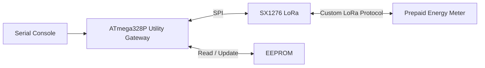
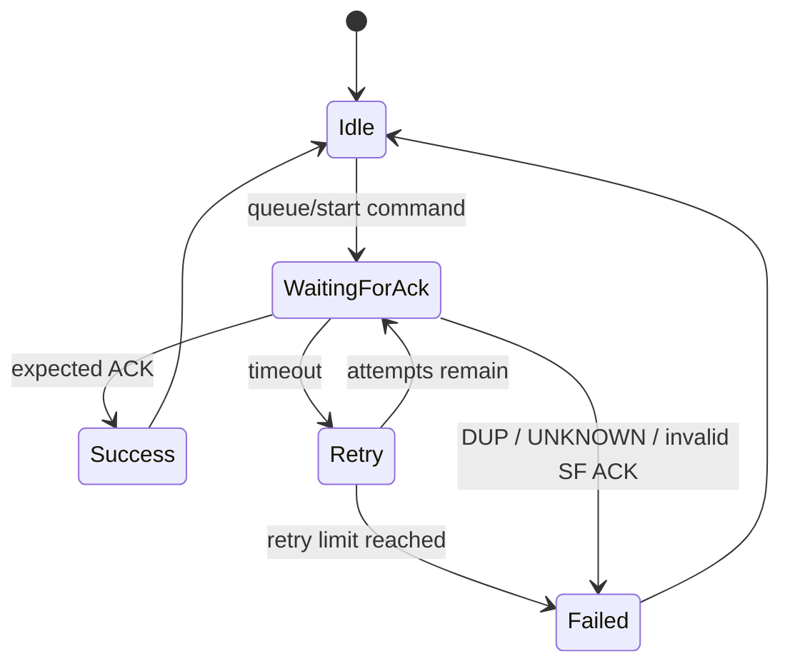

# LoRa Utility Gateway

Firmware for the **utility-side gateway** of a wireless prepaid energy-meter system, built on an **Arduino Uno/Nano (ATmega328P)** with an **SX1276 LoRa transceiver**.

The gateway receives meter telemetry, acknowledges packets, sends recharge/tariff/radio-configuration commands, adapts the LoRa spreading factor from link quality, persists the last working radio configuration in EEPROM, and automatically scans for the meter after startup or link loss.

The project focuses on **reliable embedded communication**, **explicit state machines**, **fault recovery**, and **resource-conscious firmware design** on an 8-bit MCU.

---

## Key Firmware Features

- Custom bidirectional point-to-point LoRa protocol
- ACK-based command delivery with bounded retries
- Monotonic transaction IDs for replay/stale-command rejection
- Gateway transaction-counter resynchronization from meter telemetry
- Adaptive spreading-factor selection using RSSI and SNR
- Three-sample voting before automatic SF changes
- Safe two-device SF handoff protocol
- SF7 rendezvous channel for recovery
- Automatic SF sweep after startup or prolonged silence
- EEPROM persistence of the last working spreading factor
- Commands held while the gateway is unsynchronized, then released after link recovery
- AVR hardware watchdog recovery
- LoRa hardware CRC
- Fixed-size static buffers; no Arduino `String` usage
- Serial console for configuration, diagnostics, and utility commands

---

## Hardware

| Component | Purpose |
|---|---|
| Arduino Uno / Nano | ATmega328P gateway controller |
| SX1276 LoRa module | Wireless link to the meter |
| USB/UART serial interface | Operator console and debugging |
| Internal EEPROM | Last known spreading-factor persistence |

### LoRa Pin Mapping

| SX1276 Signal | ATmega328P Pin |
|---|---:|
| NSS / CS | D10 |
| RESET | D7 |
| DIO0 | D2 |
| MOSI | Hardware SPI MOSI |
| MISO | Hardware SPI MISO |
| SCK | Hardware SPI SCK |

The firmware uses:

```text
Frequency : 865 MHz
Sync word : 0x3B
TX power  : 17 dBm
SF range  : SF7 ... SF12
Rescue SF : SF7
```

> The frequency and sync word must match the meter-node firmware.

---

## System Architecture



The gateway performs four main jobs:

1. receive and acknowledge meter telemetry,
2. send utility commands reliably,
3. keep both radios synchronized while changing spreading factor,
4. recover automatically when the link is lost or either device restarts.

---

## Main Loop

The firmware uses a **cooperative main-loop architecture** rather than an RTOS.

```cpp
void loop() {
    wdt_reset();
    if (LoRa.parsePacket() > 0) incoming();
    console();
    service();
    supervise();
}
```

Each service performs a small part of the application:

```text
loop()
 ├─ service watchdog
 ├─ poll LoRa for received packet
 ├─ process serial console
 ├─ service pending command / retry timer
 └─ supervise synchronization and recovery scan
```

LoRa reception is **polled through `LoRa.parsePacket()`**; this firmware does not claim interrupt-driven LoRa reception.

---

## Communication Protocol

Packets use a compact text protocol enclosed in `< >`.

The configured meter node is:

```text
Node1
```

### Telemetry

Typical meter telemetry:

```text
<Node1;TLM;ID:42;V:230.1;I:1.250;P:270.4;PF:0.94;BAL:96.21;RT:8.00;SF:7>
```

The gateway extracts the transaction high-water mark from `ID` and can use the packet's `SF` field to match the meter's actual radio configuration.

### Telemetry ACK

Every valid telemetry packet is acknowledged with:

```text
<Node1;TAK;ID:42>
```

The ACK is transmitted **before any radio retune**, because the meter is still listening on the spreading factor it used for telemetry.

### Utility Command

Commands use:

```text
<Node1;CMD;ID:<transaction_id>;<command>>
```

Example recharge command:

```text
<Node1;CMD;ID:43;RECH:500.00>
```

Example tariff command:

```text
<Node1;CMD;ID:44;TARI:8.50>
```

Example spreading-factor command:

```text
<Node1;CMD;ID:45;SF:9>
```

### Command ACK

The meter replies with packets such as:

```text
<Node1;ACK;ID:45;ST:SF_OK;SF:7>
```

The gateway explicitly treats `DUP` and `UNKNOWN` as failures rather than successful commands.

### Dying-Gasp Packet

A meter blackout notification is recognized as:

```text
<Node1;GASP;ID:42;BAL:96.32>
```

The gateway reports these packets through the serial console as blackout events.

---

## Reliable Command State Machine

Only one command transaction is active at a time.



For every command, the gateway stores:

- transaction ID,
- command body,
- retry count,
- transmit timestamp,
- whether the command is an SF transition,
- previous and requested spreading factor.

### Retry Limits

Normal commands use up to **5 total attempts**.

Spreading-factor commands use up to **3 total attempts**.

ACK timeout depends on the current spreading factor:

| SF | Timeout |
|---:|---:|
| 7 | 1200 ms |
| 8 | 1600 ms |
| 9 | 2400 ms |
| 10 | 3600 ms |
| 11 | 6000 ms |
| 12 | 10000 ms |

This accounts for the longer airtime at higher LoRa spreading factors.

---

## Transaction-ID Synchronization

The meter treats its last accepted transaction ID as a high-water mark. A newly received command must use a greater ID.

A gateway reboot creates a potential synchronization problem:

```text
Meter high-water ID : 250
Gateway after reset : 0
```

If the gateway immediately sent ID `1`, the meter would correctly reject it as stale.

The gateway solves this by reading `ID` from meter telemetry:

```cpp
if (id > txCounter) {
    txCounter = id;
}
```

The next command is therefore generated as:

```text
251
```

This allows transaction state to recover automatically after a gateway restart without storing every command ID in EEPROM.

---

## Commands Held While Unsynchronized

The gateway does not blindly transmit utility commands when it has not yet found the meter.

If a command is entered while unsynchronized:

```text
Operator Command
      │
      ▼
Gateway not synchronized
      │
      ▼
Hold one command locally
      │
      ▼
Continue SF scan
      │
      ▼
Meter telemetry received
      │
      ▼
Synchronize transaction ID / SF
      │
      ▼
Release held command
```

Only one held command is supported at a time.

---

## Adaptive Spreading Factor

Automatic spreading-factor selection uses both **RSSI** and **SNR** from received telemetry.

### RSSI-Based Recommendation

| RSSI | Initial Recommendation |
|---|---:|
| `>= -85 dBm` | SF7 |
| `>= -95 dBm` | SF8 |
| `>= -105 dBm` | SF9 |
| `>= -115 dBm` | SF10 |
| `>= -120 dBm` | SF11 |
| `< -120 dBm` | SF12 |

The recommendation is then adjusted using SNR:

- if `SNR >= 8 dB`, reduce the SF by one when possible,
- if `SNR <= -5 dB`, increase the SF by one when possible.

This algorithm is project-specific adaptive link control; it is **not LoRaWAN ADR**.

---

## Three-Vote SF Filtering

A single RSSI/SNR measurement does not trigger a radio change.

The gateway stores three consecutive recommendations:

```text
Packet 1 -> SF9
Packet 2 -> SF9
Packet 3 -> SF9
             │
             ▼
      initiate SF change
```

All three votes must match.

This reduces unnecessary SF transitions caused by momentary fading or noise.

The firmware also enforces a **60-second SF cooldown** between automatic changes.

---

## Safe SF Handoff

Changing the spreading factor is a distributed synchronization problem: both radios must move without losing the confirmation packet.

The implemented sequence is:

```text
Gateway @ OLD SF
      │
      ├── Send <...;SF:new>
      │
      └── Stay on OLD SF
               │
               ▼
        Meter receives command
               │
               ├── Send SF_OK on OLD SF
               └── Switch to NEW SF
                        │
                        ▼
                Gateway receives SF_OK
                        │
                        └── Switch to NEW SF
```

The gateway intentionally **does not optimistically retune immediately after sending the command**.

If the command never reaches the meter, both devices remain on the old spreading factor and communication is not orphaned.

---

## Automatic SF Failure Protection

Repeated automatic SF transitions can make an unstable link worse.

The firmware counts failed SF transactions.

After **3 consecutive SF-change failures**, automatic SF adaptation is disabled:

```text
[SF] 3 failures -- auto SF DISABLED. Fix the link, then AUTO:ON
```

The operator can later re-enable it using:

```text
AUTO:ON
```

---

## Link Recovery and SF Scanning

At boot, the gateway loads the last known spreading factor from EEPROM and begins a recovery scan.

The scan order starts with the stored hint and then covers SF7 through SF12 while repeatedly interleaving **SF7 as a rendezvous channel**.

Conceptually:

```text
Last-known SF
     ↓
SF7 → SF8 → SF7 → SF9 → SF7 → SF10 → SF7 → SF11 → SF7 → SF12 → SF7 ...
```

Each scan position is held for:

```text
20 seconds
```

The dwell time is intentionally longer than the meter telemetry interval so the gateway has a chance to hear a transmission at that SF.

---

## Silence Detection

Once synchronized, the gateway monitors how long it has been since any valid packet was heard.

After **60 seconds of silence**:

```text
Synchronized Link
      │
      ▼
60 s without packets
      │
      ▼
Drop synchronized state
      │
      ▼
Start SF recovery scan
```

If an SF command is pending when the link is declared lost, that SF transaction is failed before scanning begins.

---

## EEPROM Persistence

The gateway stores only a small radio hint in EEPROM:

```text
Address 0 : magic value 0x5A
Address 1 : last working SF
```

The code uses `EEPROM.update()` so unchanged bytes are not rewritten unnecessarily.

On startup:

1. validate the EEPROM magic byte,
2. read the saved SF,
3. validate it is within SF7–SF12,
4. otherwise fall back to SF7.

The saved SF is a **startup hint**, not an assumption that both radios are definitely synchronized.

The recovery sweep still runs after boot.

---

## Watchdog Recovery

The gateway uses the AVR hardware watchdog with an **8-second timeout** during normal operation.

```text
Normal loop
   │
   └── wdt_reset()

Firmware lockup
   │
   └── watchdog expires
            │
            ▼
         MCU reset
```

LoRa initialization is also bounded.

If `LoRa.begin()` fails more than 10 times, the code enables a short watchdog timeout and intentionally resets the MCU instead of remaining stuck forever in initialization.

---

## LoRa CRC

Hardware packet CRC is enabled with:

```cpp
LoRa.enableCrc();
```

This provides radio-level corrupted-packet detection before the application protocol processes data.

ACKs, transaction IDs, and retries provide the higher-level delivery/recovery behavior.

---

## Memory-Conscious AVR Design

The firmware is designed for the limited SRAM and flash of the ATmega328P.

Examples include:

- fixed-size global character buffers,
- no Arduino `String` objects,
- `F()` for flash-resident serial strings,
- `snprintf()` for bounded packet construction,
- `dtostrf()` for float-to-text conversion on AVR,
- compact text packet parsing with `strstr()` / `strncmp()`,
- explicit state variables instead of dynamic allocation,
- EEPROM storage limited to essential state.

Main buffers are statically allocated:

```cpp
static char rx[200], tx[180], cmd[64];
```

---

## Serial Console

The utility gateway runs its serial console at:

```text
9600 baud
```

### Recharge Meter

```text
RECH:500
```

Valid range:

```text
0.01 ... 10000
```

Example generated command:

```text
<Node1;CMD;ID:101;RECH:500.00>
```

---

### Set Tariff

```text
TARI:8.50
```

Valid range:

```text
0.10 ... 50.00
```

---

### Request Meter SF Change

```text
SF:9
```

Valid values:

```text
7 ... 12
```

This sends an SF command to the meter and disables automatic SF adaptation so manual and automatic control do not fight each other.

---

### Set Gateway SF Locally

```text
LSF:9
```

This:

- changes the gateway radio locally,
- writes the SF to EEPROM,
- sends nothing to the meter,
- disables auto-SF,
- marks the link unsynchronized,
- starts a new scan beginning from that SF.

---

### Automatic SF Control

```text
AUTO:ON
AUTO:OFF
```

Re-enabling auto-SF also clears the SF-failure streak.

---

### Raw Packet Logging

```text
RAW:ON
RAW:OFF
```

Raw logging shows:

- packet size,
- active SF,
- RSSI,
- SNR,
- full received packet.

---

### Force Recovery Scan

```text
SCAN
```

Marks the gateway unsynchronized and immediately begins the SF sweep.

---

### Clear EEPROM SF Hint

```text
EEWIPE
```

Clears the EEPROM magic byte so the next boot starts from the SF7 rescue/default path.

---

### Status

```text
STATUS
```

Reports state including:

- current SF,
- saved SF,
- auto-SF state,
- SF failure count,
- meter synchronization status,
- total packets seen,
- next transaction ID,
- held command,
- pending command.

---

## Important Timing and Reliability Parameters

| Parameter | Value |
|---|---:|
| SF cooldown | 60 s |
| Votes required for auto-SF | 3 |
| Normal command attempts | 5 |
| SF command attempts | 3 |
| SF failures before auto disable | 3 |
| Link silence threshold | 60 s |
| Status heartbeat while scanning | 30 s |
| Scan dwell per SF | 20 s |
| Watchdog timeout | 8 s |

---

## Startup Sequence

```text
Power On
   │
   ▼
Disable watchdog
   │
   ▼
Start Serial @ 9600
   │
   ▼
Reset SX1276
   │
   ▼
Initialize LoRa
   │
   ├── Failure -> retry (bounded)
   │                  │
   │                  └── repeated failure -> watchdog reset
   │
   ▼
Enable LoRa CRC
Set sync word / TX power
   │
   ▼
Load last-known SF from EEPROM
   │
   ▼
Start recovery scan
   │
   ▼
Enable 8 s watchdog
```

---

## Link Synchronization Sequence

```text
Gateway scanning SFs
       │
       ▼
Valid Node1 telemetry received
       │
       ├── update txCounter from meter ID
       ├── save working SF to EEPROM
       ├── mark gateway synchronized
       └── ACK telemetry on current SF
                │
                ▼
        Release held command
        if one exists
```

The meter is treated as authoritative for the transaction high-water mark after a gateway reboot.

---

## Repository Structure

Current project structure:

```text
.
├── utility_center.ino
└── README.md
```

---

## Dependencies

### External Library

- **LoRa by Sandeep Mistry** (`arduino-LoRa`)

### Arduino / AVR Libraries

The firmware also uses:

```text
SPI
EEPROM
string.h
avr/wdt.h
```

---

## Building and Uploading

### 1. Install Arduino IDE or compatible AVR build environment

Select the board that matches your hardware, for example:

```text
Arduino Uno
```

or:

```text
Arduino Nano
```

### 2. Install the LoRa library

Install **LoRa by Sandeep Mistry** through the Arduino Library Manager.

### 3. Verify radio settings

Confirm the gateway and meter use the same:

```text
LoRa frequency
sync word
supported SF range
rescue SF
node ID
```

Current gateway values are:

```cpp
#define NODE_ID        "Node1"
const long LORA_FREQ = 865E6;
#define LORA_SYNC_WORD 0x3B
#define SF_RESCUE      7
```

### 4. Upload

Compile and upload `utility_center.ino` to the target Uno/Nano.

### 5. Open Serial Monitor

Use:

```text
9600 baud
Newline line ending
```

The gateway starts with raw packet logging enabled.

Disable it with:

```text
RAW:OFF
```

---

## Known Limitation: No Packet Authentication

The protocol uses a monotonic transaction ID to reject stale/replayed commands, but packets are **not cryptographically authenticated**.

That means transaction IDs protect against replay of an already-used command ID, but they do not prevent an attacker who knows the protocol from constructing a new forged packet with a higher ID.

A production design should add authenticated messages using device-specific cryptographic keys.

---

## Other Current Design Constraints

- The firmware supports a single configured meter node (`Node1`).
- Only one command can be actively pending at a time.
- Only one command can be held while the gateway is unsynchronized.
- LoRa receive servicing is polling-based through `LoRa.parsePacket()`.
- Adaptive spreading-factor logic is custom and is not LoRaWAN ADR.
- The gateway stores the last known SF but does not persist the transaction counter; the counter is recovered from meter telemetry instead.

---

## Engineering Concepts Demonstrated

This project demonstrates practical work with:

- Embedded C/C++
- ATmega328P / AVR
- SPI peripheral communication
- SX1276 LoRa radios
- Custom embedded communication protocols
- Command/ACK transaction state machines
- Timeout and bounded retry mechanisms
- Distributed radio-state synchronization
- RSSI/SNR-based link adaptation
- Recovery/rendezvous protocols
- EEPROM-backed persistent configuration
- Watchdog-based fault recovery
- Static memory management
- Fixed-size packet parsing
- Cooperative firmware architecture
- Failure-state handling and resynchronization

---

## Companion Meter Firmware

This gateway is intended to work with the corresponding prepaid meter-node firmware.

Together, the two sides implement a complete embedded link:

```text
Prepaid Meter Node                         Utility Gateway
──────────────────                         ───────────────
Energy measurement                        Telemetry reception
Prepaid billing                            Telemetry ACK
Relay control            <── LoRa ──>      Recharge commands
RTC / persistent state                     Tariff commands
Dying-gasp handling                        Transaction tracking
LoRa telemetry                             Adaptive SF control
Wi-Fi fallback                             Link recovery scanning
```

---

## Disclaimer

This firmware is a prototype/educational utility-gateway implementation. It is not a production utility-control system and does not provide cryptographic command authentication.

Security hardening, regulatory validation, RF compliance, electrical safety, extensive fault testing, and production-level provisioning would be required before real-world deployment.
